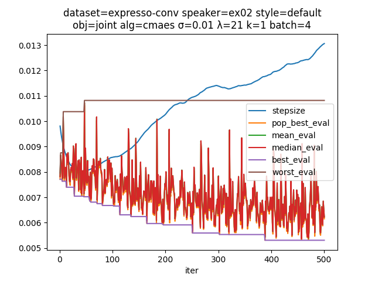

# coconut - black box optimization of kokoro style tensors
Inspired by [kvoicewalk](https://github.com/RobViren/kvoicewalk), this is a training script for optimizing kokoro style tensors. This variation on the idea additionally incorporates:

- distribution based evolutionary algorithms (XNES, SNES, CMA-ES, CEM)

- batched & vectorized generation/evaluation for much higher throughput candidate testing

- [mimi](https://huggingface.co/kyutai/mimi) embeddings for perceptual loss

- ability to pull from a huggingface dataset and regularize across minibatches of examples

# notes
- it's very difficult (impossible?) to get kokoro to model out of distribution voices by tweaking style tensors; arbitrary 'deep' clones are infeasible via this method

- shallow clones (voices that sound similar but without inflective characteristics) work OK

- it's really easy to overcook style tensors with poor hyperparameter choices

- audio in general is very sensitive to choice of loss

- there seems to be a sweet spot where perceptual characteristics develop quickly and degrade soon after

In summary, this approach is probably a dead end; kokoro is trained on narrow-domain synthetic data and doesn't have the generalization power to model arbitrary voices + inflections with just a voicepack update. Some voices fit well, others do not, and the common factor seems to be: how close is it to the synthetic data it was trained on?

A hypothetical kokoro trained on broader corpus would likely do much better at this task.

# usage
Fit `ex02` `default` with an interpolation of all initial voices + bias term:

```shell
$ uv run train.py --dataset expresso-conv --speaker ex02 --style default --interp voices --bias
...
INFO:root:ep=3 it=0475 ∧=5.307e-03 λ∧=7.726e-03 μ=7.8508e-03 t+0:17:12.159811
```

[At 475 steps](samples/default-475.wav)

[At 475 steps](samples/default-475.webm)



See `--help` for more options:

```shell
uv run train.py --help
```

# datasets
- [ylacombe/expresso](https://huggingface.co/datasets/ylacombe/expresso)
- [nytopop/expresso-conversational](https://huggingface.co/datasets/nytopop/expresso-conversational)
- [taresh18/AnimeVox](https://huggingface.co/datasets/taresh18/AnimeVox)
- [simon3000/genshin-voice](https://huggingface.co/datasets/simon3000/genshin-voice)

It's fairly straightforward to adapt to your own dataset: ensure `audio`, `transcription`, and `speaker` columns are present. Examples of munging the above datasets into that format are available in [`train.py`](train.py), which is mostly as simple as:

```python
ds = load_dataset("taresh18/AnimeVox", split="train", streaming=streaming)
ds = ds.rename_columns({"character_name": "speaker"})
```
